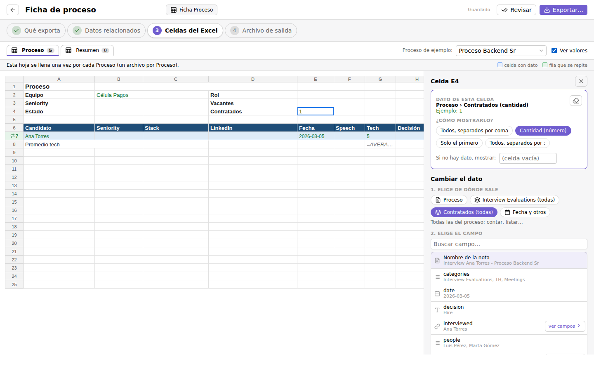
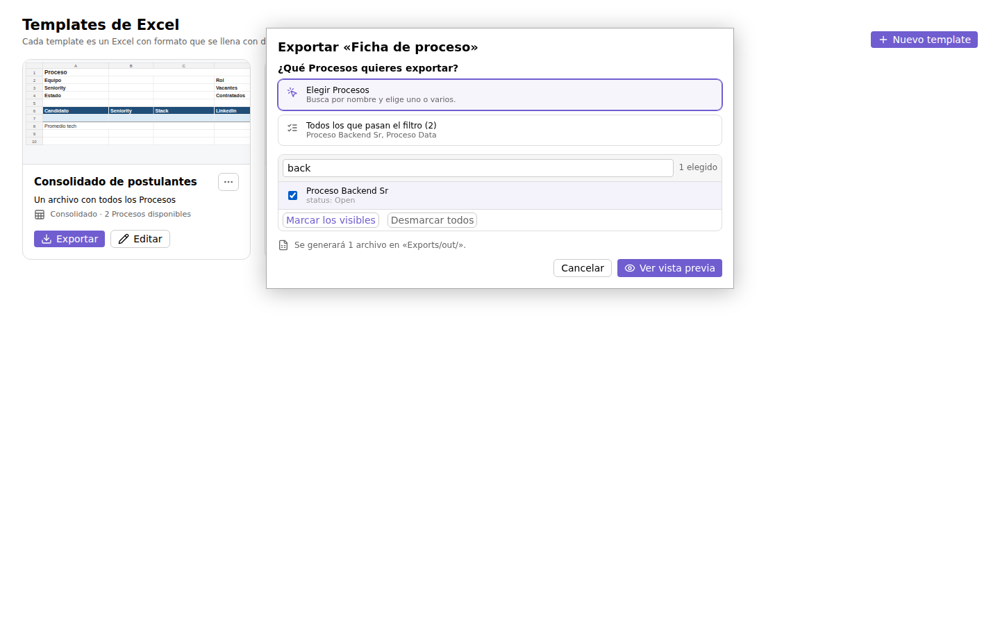
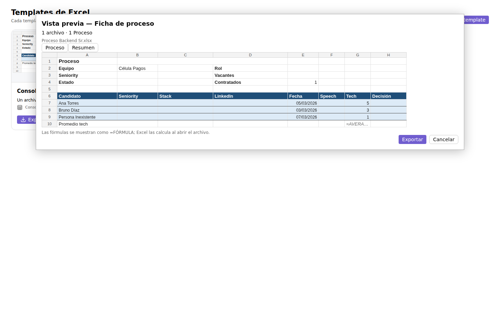

# Excel Template Export

Fill formatted Excel templates with data from your Obsidian notes, preview the result and export it as `.xlsx` files.

- Keep your own Excel design (colors, column widths, merged cells, logos, formulas). The data cells can stay empty.
- Choose which notes each export is about, for example a recruiting process, and pull in related notes that link to it, such as its interviews and the people interviewed.
- Map cells visually: click a cell, pick where the data comes from and how to show it. Click a row to repeat it once per related note.
- Pick the notes to export from a searchable list, then preview the workbook inside Obsidian before saving it.

The user interface is currently in Spanish.




**Privacy:** the plugin works offline. It makes no network requests and only reads and writes files inside your vault.

---

## En español

Plugin de Obsidian que llena templates de Excel (`.xlsx`) con las properties (frontmatter) de tus notas, **preservando el formato del template**: colores, anchos, celdas combinadas, logos y fórmulas.

Sirve para:

- **Una nota puntual**, por ejemplo la nota abierta.
- **Varias notas** elegidas de una lista, o todas las que cumplen un filtro.
- **Relaciones entre notas**: trae las notas que apuntan a cada una (por ejemplo las Interviews de un Proceso) y sigue sus links (la Persona entrevistada).




**Privacidad:** funciona sin conexión. No hace peticiones de red y solo lee y escribe archivos dentro de tu vault.

## Instalación

Desde Obsidian: *Settings → Community plugins → Browse*, busca «Excel Template Export» e instálalo.

Manual: descarga `main.js`, `manifest.json` y `styles.css` de la [última release](../../releases/latest) y cópialos a `<vault>/.obsidian/plugins/excel-template-export/`.

En [`examples/`](examples/) hay dos Excel de ejemplo (`Proceso.xlsx`, `Consolidado.xlsx`) y `templates.json` con dos templates ya configurados para ellos.

## Cómo se usa

Todo se maneja desde **Templates de Excel**: el icono de hoja de cálculo en la barra lateral, o el comando *Abrir templates de Excel*.

### 1. Templates

Verás una tarjeta por template, con una miniatura del Excel, qué genera ("Un archivo por cada Proceso") y cuántas notas hay disponibles. Desde cada tarjeta puedes **Exportar**, **Editar**, duplicar o eliminar.

**Nuevo template**: subes un Excel desde tu computador (o eliges uno del vault) y le pones nombre. El Excel solo necesita títulos y formato; las celdas de datos pueden quedar vacías.

### 2. Editor del template (4 pasos)

1. **Qué exporta**: de qué tipo de nota sale cada exportación. El plugin sugiere los tipos que encuentra en tu vault (por `categories`, `tags`, `type` o carpeta) y basta un clic. También eliges cómo llamarlas («Proceso»), un filtro por defecto (por ejemplo «status no es Closed») y el orden. Los filtros se arman con desplegables: campo, condición y un valor elegido de los que existen en tus notas. Si prefieres, puedes escribirlos como texto.
2. **Datos relacionados**: notas que apuntan a cada Proceso. El plugin detecta, por ejemplo, que «4 notas Interview Evaluations apuntan a un Proceso mediante `process`» y lo agregas con un clic. Puedes renombrarlas («Interviews») y crear **subconjuntos**, como «Contratados = Interviews cuya decision es Hire».
3. **Celdas del Excel**: ves el Excel con sus hojas en pestañas.
   - **Clic en el número de una fila**: eliges si se repite, por ejemplo «una fila por cada Interview».
   - **Clic en una celda**: eliges *de dónde sale el dato* (el Proceso, la Interview de esta fila, todas las Interviews, la fecha…), luego *el campo* (cada uno con un valor de ejemplo; los links se abren con «ver campos», por ejemplo Interview → interviewed → linkedin) y luego *cómo mostrarlo* (cantidad, lista, fecha como texto, estrellas como número…).
   - Con **Ver valores** la hoja se llena con el Proceso de ejemplo que elijas.
4. **Archivo de salida**: un archivo por Proceso, un archivo con una hoja por Proceso (eliges qué hoja se copia) o un solo archivo con todos. También el nombre del archivo (con botones para insertar «Nombre del Proceso» o «Fecha de hoy»), la carpeta y qué hacer si el archivo ya existe.

Todo se guarda solo. **Revisar** lista las celdas que no encuentran datos.

### 3. Exportar

Desde la tarjeta, el editor, el comando *Exportar a Excel…* o el menú contextual de una nota.

- Se abre **¿Qué Procesos quieres exportar?**: una lista con buscador donde marcas uno o varios, o eliges «Todos los que pasan el filtro».
- Si lo abres desde una nota, esa nota ya viene marcada.
- Antes de guardar se muestra una **vista previa** dentro de Obsidian (archivo por archivo y hoja por hoja). Los `.xlsx` se escriben solo al confirmar con **Exportar**.

Los templates se guardan en los datos del plugin (`.obsidian/plugins/excel-template-export/data.json`), no en notas. Las definiciones YAML antiguas (bloques `excel-export` en notas) se pueden importar con un botón desde la galería o con el comando *Importar definiciones desde notas*.

## Referencia avanzada

El formato interno de un template es el mismo que el de las definiciones YAML anteriores. Lo que sigue es útil para casos avanzados, como el modo «texto» de los filtros o el campo «Avanzado» de una celda.

### Placeholders escritos en el Excel (opcional)

| Sintaxis | Qué hace |
|---|---|
| `{{proceso.role}}` | Escalar. Si la celda tiene **solo** el placeholder, se escribe el valor tipado (número, fecha, booleano) y se respeta el formato de número de la celda. Mezclado con texto (`Rol: {{proceso.role}}`) da texto. |
| `{{interviews.tech rating}}` | Los nombres de property pueden tener espacios. |
| `{{proceso["mi.prop"]}}` | Corchetes para nombres con puntos. |
| `{{interviews.interviewed.seniority}}` | Si un segmento es un link, se resuelve y se navega. Si es una lista de links, se mapea. |
| `{{proceso.file.name}}` | Pseudo-properties: `file.name`, `file.path`, `file.folder`, `file.ext`, `file.ctime`, `file.mtime`, `file.link`. |
| `{{@index}}`, `{{@count}}`, `{{@today}}`, `{{@now}}`, `{{@exportName}}` | Variables especiales (`@index` es 1-based dentro de un `#each`). |
| `{{#each interviews}}…` | Al **inicio** de una celda: marca la fila como plantilla y la repite una vez por elemento (copiando estilos, alto y merges horizontales). Un `#each` por fila; puede haber varias filas `#each` por hoja. |

Dentro de una fila `#each interviews`, `{{interviews.decision}}` es el elemento actual y los campos de la raíz siguen disponibles (`{{proceso.role}}`).

#### Pipes

`{{path | pipe:arg | pipe}}`

| Pipe | Efecto |
|---|---|
| `raw` | Sin normalizar (mantiene `[[...]]`). |
| `target` | Nombre de la nota destino en vez del alias. |
| `join:"; "` | Separador de lista. |
| `first` | Primer elemento de una lista. |
| `count` | Tamaño de una lista o colección: `{{hires \| count}}`. |
| `stars` | Cuenta ⭐ (½ suma 0.5) y devuelve un número. |
| `date:"dd/MM/yyyy"` | Formatea como texto (tokens `yyyy yy MM M dd d HH H mm ss`). Sin pipe, las fechas van como fecha de Excel. |
| `default:"-"` | Valor si está vacío. |
| `upper` / `lower` | Mayúsculas / minúsculas. |
| `link` | Hipervínculo a `obsidian://open?...` con el texto normalizado. |

### Modos

| Modo | Resultado |
|---|---|
| `file-per-root` | Un `.xlsx` por nota raíz. |
| `sheet-per-root` | Un `.xlsx`; la primera hoja del template se clona por raíz (nombre de hoja sanitizado a 31 caracteres y sin repetir). Las demás hojas se mantienen y ven la colección de raíces (`{{proceso \| count}}`, `{{#each proceso}}`). |
| `single` | Un `.xlsx`; la colección de raíces se llama como el alias: `{{#each proceso}}`. **Flatten:** `{{#each proceso.interviews}}` da una fila por interview, con acceso al padre (`{{proceso.role}}`) y al elemento (`{{interviews.interviewed}}`). Dentro de `{{#each proceso}}` también están las relaciones de cada raíz (`{{interviews \| count}}`). |

### Filtros

```
expr  := or ;  or := and ("or" and)* ;  and := unary ("and" unary)*
unary := "not" unary | "(" expr ")" | path op value | path ("exists" | "!exists")
op    := == | != | > | >= | < | <= | contains | !contains
value := "texto" | 123 | true | false | null | today | date("2026-03-01") | alias
```

- **Links:** se comparan contra el nombre de la nota destino, sin distinguir mayúsculas. `role == "Backend"` matchea `[[Backend]]` y `[[Roles/Backend|Back]]`.
- **Listas:** `contains` verifica pertenencia; `==` es verdadero si algún elemento coincide.
- **Texto:** `contains` es substring sin distinguir mayúsculas.
- **Fechas:** ISO (`YYYY-MM-DD`, hora opcional); `today` es la fecha local.
- **Campos faltantes:** toda comparación es falsa, salvo `!=`, `!contains` y `!exists`. `campo == null` es verdadero si falta.
- Properties con espacios: `["tech rating"] >= 3`. Los paths pueden navegar links: `interviewed.seniority == "Junior"`.
- En los filtros de una relación, el alias de la raíz se puede usar como valor: `process == proceso`.

### Normalización de valores

| Entrada | Salida (default) |
|---|---|
| `[[Backend]]` | `Backend` |
| `[[Celula X\|Alias]]` | `Alias` (`links: target` → `Celula X`) |
| `[[Carpeta/Nota]]` | `Nota` |
| lista | elementos normalizados unidos con `listSeparator` |
| `2026-03-01` | fecha de Excel (formato de la celda o `yyyy-mm-dd`) |
| `⭐⭐⭐` | `3` |
| número / booleano | tipo nativo |
| vacío / null | `emptyValue` |
| objeto | JSON compacto + warning |

Las fechas se interpretan en hora local, sin corrimiento por zona horaria.

## Comandos

- **Abrir templates de Excel** (también en el icono de la barra lateral).
- **Exportar a Excel…**: con una nota abierta, ofrece los templates que exportan ese tipo de nota y la deja marcada; si no, te pide elegir template. También está en el menú contextual de las notas.
- **Nuevo template de Excel**.
- **Importar definiciones desde notas**: convierte bloques `excel-export` antiguos en templates.

Después de exportar aparece un aviso (`3 archivos generados, 2 warnings`) con **Ver detalle** (datos sin resolver, links rotos, fórmulas) y **Abrir carpeta**. Un dato que no se encuentra nunca cancela el export.

## Settings

| Setting | Default |
|---|---|
| Carpeta de los Excel de template (los que subes) | `Templates/Excel` |
| Carpeta de salida por defecto | `Exports/out/` |
| Links | `display` |
| Separador de listas | `, ` |
| Estrellas | `number` |
| Valor vacío | `""` |
| Fila repetida sin elementos | `remove` |
| Abrir archivo al terminar (desktop) | `false` |
| Sobrescritura por defecto | `ask` |
| Previsualizar antes de exportar | `true` |

### Formato interno de un template

Así se guarda un template en `data.json`. Es el mismo esquema que el de los bloques YAML antiguos:

```yaml
name: Ficha de proceso
template: Templates/Excel/Proceso.xlsx
root:
  alias: proceso            # nombre interno (se deriva de label)
  label: Proceso
  where: categories contains "Talent Acquisition Process"
  filter: status != "Closed"
  sort: created desc
mode: file-per-root         # file-per-root | sheet-per-root | single
relations:
  interviews:
    label: Interviews
    from: categories contains "Interview Evaluations"   # opcional
    on: process -> proceso
    sort: date asc
  contratados:
    label: Contratados
    source: interviews
    filter: decision == "Hire"
output:
  folder: Exports/out
  filename: '{{proceso.file.name}}.xlsx'
  repeatSheet: Proceso      # sheet-per-root: hoja que se copia
  sheetName: '{{proceso.file.name}}'
  overwrite: ask            # ask | overwrite | suffix
cells:
  Proceso!B2: proceso.team
  Proceso!E4: proceso.contratados | count
  Proceso!A7: interviews.interviewed
rows:
  Proceso!7: interviews
```

## Limitaciones conocidas (v1)

- **Fórmulas:** al insertar filas se ajustan las referencias A1 de la misma hoja (y las de otras hojas con prefijo `Hoja!`): las de abajo se desplazan y los rangos que contienen la fila plantilla se expanden (`AVERAGE(G7:G7)` → `AVERAGE(G7:G9)`). Si la fila `#each` queda sin elementos y se elimina, las referencias a esa fila quedan en `#REF!` (como en Excel) y se avisa en el reporte; usa `emptyBlock: blank` para conservarla. Referencias de filas completas (`7:7`), nombres estructurados y fórmulas matriciales no se ajustan.
- Conviene ubicar el bloque `#each` al final de la hoja.
- **Formato condicional y validaciones de datos** no se desplazan (se avisa).
- **Celdas combinadas** que cruzan verticalmente una fila `#each` se descombinan (con warning).
- **Tablas de Excel (ListObjects):** no se redimensionan; en `sheet-per-root` no se copian a las hojas clonadas (warning).
- Un solo nivel de repetición por fila; bloques de varias filas no están soportados (el consolidado se cubre con «Interviews de todos los Procesos»).
- Al renombrar un Proceso o una relación en el editor, las celdas que los usan se actualizan solas; los filtros escritos a mano como texto no.
- `on` solo admite `<campo> -> <aliasRaíz>`.
- No se evalúan archivos `.base`; los filtros usan su propio lenguaje.

## Decisiones sobre las preguntas abiertas (§13 del spec)

1. La property de categoría puede ser texto o wikilinks: los filtros comparan links por nombre de nota destino, así que `categories contains "TH"` funciona en ambos casos.
2. "Activo" = `status != "Closed"` (un `status` faltante cuenta como activo).
3. Estrellas: se cuenta ⭐ (con o sin selector de variación), `½` suma 0.5 y los números pasan tal cual.
4. Tablas de Excel: ver limitaciones.
5. Mobile: el core es puro, pero el manifest declara `isDesktopOnly: true` hasta probarlo.

## Desarrollo

```bash
npm install
npm test          # Vitest, en Node, sin Obsidian
npm run build     # typecheck + bundle (main.js)
npm run dev       # watch
```

### Publicar una versión nueva

```bash
npm version patch        # o minor / major: actualiza package.json, manifest.json y versions.json, y crea el tag
git push && git push --tags
```

Antes, escribe las notas en `release-notes/<versión>.md` (si no existen, se generan a partir de los commits). El workflow `Release Obsidian plugin` prueba, compila y publica la release con `main.js`, `manifest.json` y `styles.css`; Obsidian ofrecerá la actualización a los usuarios.

```
src/
  main.ts, settings.ts      # plugin, comandos, settings (Obsidian)
  adapter/                  # VaultAdapter: Obsidian + memoria (tests)
  model/                    # NoteRecord, reporte de warnings
  config/                   # schema, validación y parseo del YAML
  query/                    # lexer, parser, evaluador y sort de filtros
  graph/                    # paths, relaciones (índice inverso), runtime
  values/                   # links, normalización, pipes
  excel/                    # placeholders, scanner, motor, fórmulas, IO
  export/                   # runner (build en memoria + escritura) y validación
  setup/                    # descubrimiento de campos, tipos de nota, relaciones sugeridas, filtros visuales
  store/                    # templates guardados en el plugin (alta, renombres, estado)
  ui/                       # gestor (galería + editor en 4 pasos), exportar, vista previa, componentes
tests/                      # tests del core + fixture del dominio (vault.json)
```

El core (`query`, `graph`, `values`, `excel`, `export`, `config`) no importa `obsidian`; Obsidian entra solo por `adapter/obsidian-adapter.ts` y `ui/`.
